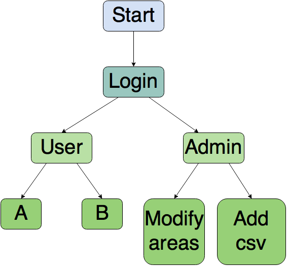

# Web-application
A webpage that will use the administrators and users to see the status of the parking lots and cotrol the system.

An app for the admistrators where only us can make changes to the app or the webpage. If new areas are added to the parking lot, there should be added to the Mobile-Application by using the web-application.

When the administrators get usefull data from the users, like the most popular area, or the peak times where the parking lot is almost full, the app should evolve in order to make the user experience better. Maybe recommending areas for users that go to that area relativelly often, or in the necesary case, implement a new area.

